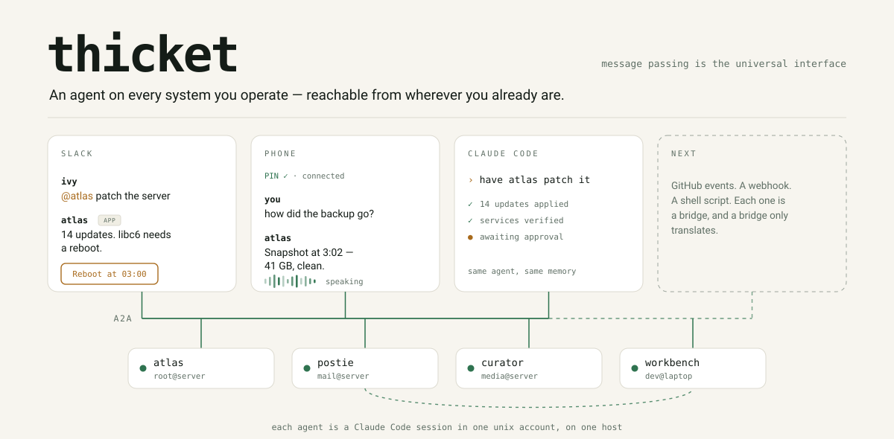

<p align="center">
  <picture>
    <source media="(prefers-color-scheme: dark)" srcset="docs/assets/banner-dark.svg">
    
  </picture>
</p>

A fleet of AI agents that live on the systems you operate, reachable from Slack, from a
phone call, or from Claude Code, and able to collaborate with each other.

Each agent is a Claude Code session bound to one unix account on one host. It speaks
[A2A](https://a2a-protocol.org) over your tailnet and appears in Slack as its own app
with a native agent surface. Adding an agent is a config change plus a provisioning run.

This is one operator's fleet, built in the open. Issues and questions are welcome;
the [roadmap](docs/roadmap.md) is the operator's, and [docs/vision.md](docs/vision.md)
is the argument behind it.

```
Slack ────────► bridge ─┐
a phone call ─► phone ──┤
Claude Code (MCP) ──────┴──► A2A ──► agentd (per unix account) ──► Claude Code session
                                                                   via Agent SDK
```

## Why it is shaped this way

An agent's identity is a `(host, unix user)` pair, because that is the boundary that
actually constrains what it can touch. Specialization comes from skills and `CLAUDE.md`
inside that account, not from separate agent identities. Agents that ingest untrusted
content (email, torrents, the web) run in accounts that cannot reach accounts holding
privilege, and Tailscale ACLs enforce that at the network layer.

See [docs/vision.md](docs/vision.md) for the full rationale.

## Components

| Path | Language | Role |
|---|---|---|
| `netd/` | Go | tsnet node per agent; tailnet ⇄ unix socket, injects verified peer tags |
| `apps/agentd/` | TypeScript | A2A server + Claude Code session manager (hot/cold) |
| `apps/bridge/` | TypeScript | Slack Socket Mode ⇄ A2A client; thread ⇄ session mapping |
| `apps/phone/` | TypeScript | Twilio ConversationRelay ⇄ A2A; the PIN gate, the picker, the call |
| `apps/cli/` | TypeScript | `provision`, `render`, `doctor`, `fleet`, `journal`, `send`, `mcp`, `phone-test`, `slack-test-mcp` |
| `packages/roster/` | TypeScript | `agents.yaml` → `AgentCard`; the shared contract |
| `packages/executor/` | TypeScript | Agent SDK message stream → A2A task events |
| `packages/slack-manifest/` | TypeScript | `AgentCard` → Slack app manifest |
| `deploy/` | — | systemd units (user units for agents, system units for the edge), the SELinux module, launchd plists, and a local dev rig |
| `tests/integration/` | TypeScript | real agentd + real bridge over HTTP; only Slack is faked |

## Status

Running, for one operator, on a home server: four agents, each its own unix
account with `agentd` and `netd`, plus the Slack and phone bridges as system
units under dedicated accounts. The Slack surface — DMs, mentions, threads,
streamed answers with a step timeline, attachments, questions with buttons,
reactions, routines and one-shot schedules — works end to end. The phone bridge
is the second surface: a call authenticates on an 8-digit PIN keyed at connect,
picks an agent by name, and holds a session that survives a dropped call. Both
run on the server and are reached with the laptop closed.

Deployment is by attested release: a tag push publishes per-platform archives,
and a host installs one by verifying its provenance and unpacking it — the
operator's own deployment does this from Ansible. There is no `thicket install`
yet ([#16](https://github.com/ivy/thicket/issues/16)), so a host still needs its
own unit files; [deploy/](deploy/) has the reference set. `provision` runs from
a workstation, not from a deployed account
([#85](https://github.com/ivy/thicket/issues/85)). The laptop rig in
[deploy/dev/](deploy/dev/) stands in for netd where there is no tailnet.

What is ahead is trust, not reach: approvals for the acts an agent may not take
alone ([#10](https://github.com/ivy/thicket/issues/10)), privilege where a
deployed agent's job needs it ([#91](https://github.com/ivy/thicket/issues/91)),
and the surface bugs that still produce a moment of "what is it doing?" — see
the [roadmap](docs/roadmap.md).

Work is tracked in [GitHub issues](https://github.com/ivy/thicket/issues).
[docs/reference.md](docs/reference.md) has the runtime topology and the hard-won facts
about the APIs involved. [AGENTS.md](AGENTS.md) is the map for anyone (or any agent)
working in the repo.

## Requirements

- Node 22+ and Go 1.27+ — both pinned in [mise.toml](mise.toml), along with pnpm.
  Node 22 is a floor, not a preference: the task store and the bridge's state both
  use `node:sqlite`.
- A Tailscale tailnet with ACL tags you control, and tag owners for `tag:thicket-*`
- A Slack workspace where you can create apps, and an
  [app configuration token](https://api.slack.com/authentication/config-tokens).
  One app per agent, and the free plan caps installs at 10.
- Claude Code authenticated in each agent's unix account. Sessions inherit that
  account's own credentials; anything else they need is named in `env_passthrough`
  in the account's `agentd.json`.

## License

[ISC](LICENSE).
